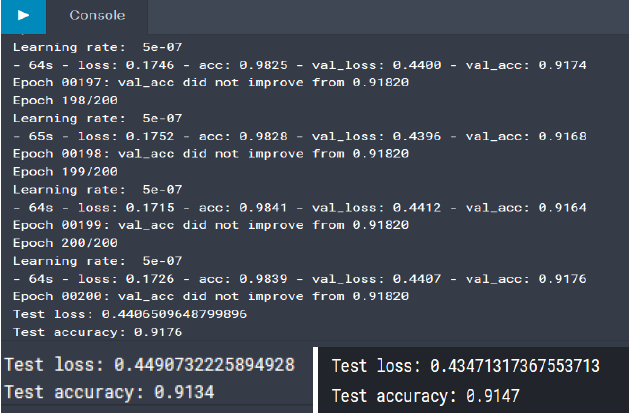
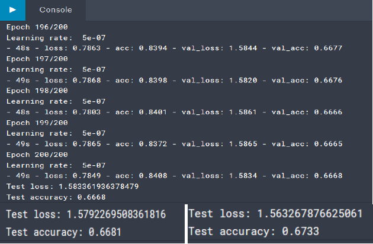
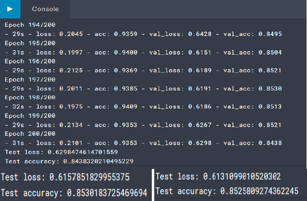
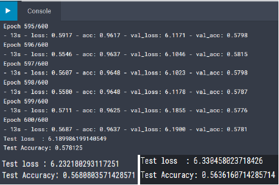
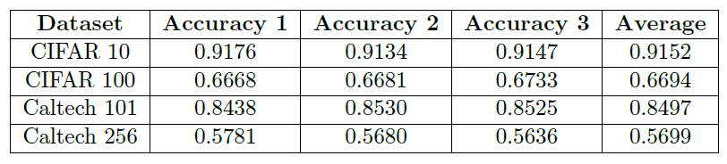

# Neural-Networks-Machine-Learning
Neural Networks &amp; Machine Learning on different Datasets (Object-centric Image recognition) 1. CIFAR 10 2. CIFAR 100 3. Caltech 101 4. Caltech 256

# <h1> 1 Project Description
As per the project assigned to the class, I have chosen to work with the four datasets which
have been provided. They are
1. CIFAR 10
2. CIFAR 100
3. Caltech 101
4. Caltech 256

# <h1> 2 Data Description
# <h3> 2.1 CIFAR 10 and CIFAR 100
The CIFAR-10 dataset[3] consists of 60000 32x32 colour images in 10 classes, with 6000 images per class. There are 50000 training images and 10000 test images. The 10 classes are Airplane, Automobile, Bird, Cat, Deer, Dog, Frog, Horse, Ship, Truck. CIFAR 100[3] is just like the CIFAR-10, except it has 100 classes containing 600 images each. There are 500 training images and 100 testing images per class. The 100 classes in the CIFAR-100 are grouped into 20 superclasses. Each image comes with a "fine" label (the class to which it belongs) and a "coarse" label (the superclass to which it belongs). The dataset is divided into five training batches and one test batch, each with 10000 images. The test batch contains exactly 1000 randomly-selected images from each class. The training batches contain the remaining images in random order, but some training batches may contain more images from one class than another. Between them, the training batches contain exactly 5000 images from each class.
# <h3> 2.2 Caltech 101 and Caltech 256
The Caltech 101[1] dataset consists of 9146 colour images in 101 object classes and an extra background class with random internet images.
Caltech 256 is just like the Caltech 101 dataset except it has 256 classes containing a total of 30607 images.

# <h1> 3 Approach
# <h3> 3.1 CIFAR 10 and CIFAR 100
I considered various pre-existing neural network models such as Alexnet, VGG16 and Resnet in an exploratory manner in order to identify the model with the highest accuracy.
The exploratory analysis revealed that the Resnet model as described provided the maximum accuracy.
So I implemented the Resnet and fed the data while including data augmentation.
I used the same model to train and predict for both CIFAR 10 and CIFAR 100 datasets.
# <h3> 3.2 Caltech 101
Since the data set is large and not uniform and the number of classes are higher than the CIFAR datasets, I was unable to reuse the resnet model for the Caltech datasets.
So I again used various pre-existing models in order to nd the model with the highest accuracy.
I then used transfer learning and used the weights of a VGG19 model which is trained on a imagenet dataset.
I imported the Weights into a densenet in order to build the model. I pre-processed the Caltech 101 dataset in order to make it into a square image in order to make it easier for fitting into the model. I cropped the images to overcome the memory limitation. I then split the data in a 3:1 ratio where 75 percent of the data is used for training and 25 percent of the data is used for testing.
I then fed the data along with some data augmentation into the model in order to train the model and evaluated the model for its accuracy. The model can perform much better and can provide higher accuracy if uncropped dataset is fed.
# <h3> 3.3 Caltech 256
Since clatech 256 is a large dataset and due to memory limitations we used a sampling
method to use a portion of the data.
We used a different neural network model which involves a VGG16 network which works better with downsampled data. I use pre-trained weights for the VGG16 model.
I sampled 10 images from each class for training and 7 images from each class for testing.
I then shuffed so that each time different sample of images is taken. I also ran this model for 600 epochs so that many dierent images will be trained and tested.
The model used for Caltech 101 will also work with Caltech 256 but the image size must be reshaped to 32x32 due to memory limitations which produced very low accuracy. Thus with sufficient memory will provide a vast improvement to the current accuracy.

# <h1> 4 Screenshots
# <h3> 4.1 CIFAR 10 Accuracy Screenshots
  
  
 
# <h3> 4.2 CIFAR 100 Accuracy Screenshots

 
 
# <h3> 4.3 Caltech 101 Accuracy Screenshots

 

# <h3> 4.4 Caltech 256 Accuracy Screenshots
  
 

# <h1> 5 Summary of Results
I have tabulated the results in the below table for your reference. The following are the links to the source code for the four datasets.

CIFAR 10 - https://www.kaggle.com/minbavel/cifar-10?scriptVersionId=11994333

CIFAR 100 - https://www.kaggle.com/minbavel/cifar-100-final

Caltech 101 -https://www.kaggle.com/minbavel/caltech-101

Caltech 256 - https://www.kaggle.com/minbavel/caltech-256-final?scriptVersionId=12022938

Table 1: Summary of Accuracies for all the four datasets respectively

